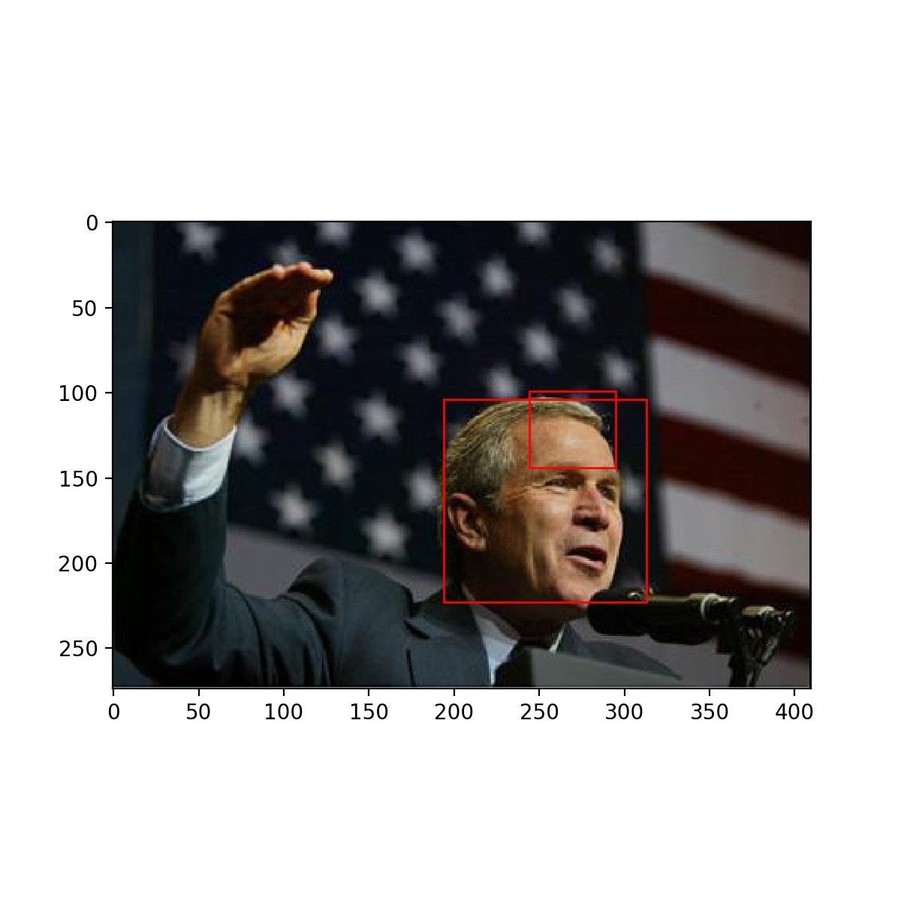

# Fast-RCNN

## Usage
    
    1. Clone and navigate to the repository

    2. Use the following links to download a complete FDDB dataset:
            
            http://vis-www.cs.umass.edu/fddb/

    3. run generate_dataset.py to generate train and val dataset. The final structure of the folder is as follows:

        -- /data
            -- /FDDB
                -- /FDDB-folds
                -- /originalPics
                    -- /2002
                    -- /2003
            -- /FDDB_crop
                -- /iou_0.5
                    -- /train
                        -- /0
                        -- /1
                    -- /val
                        -- /0
                        -- /1
                -- /iou_0.7
                    -- /train
                        -- /0
                        -- /1
                    -- /val
                        -- /0
                        -- /1
        -- /model
        -- /logs

    4. run train_CNN.py, training the classification model.
    5. run train_svm.py, training the svm classifier using extracted featuremap from CNN.
    6. run demo.py to see result:

